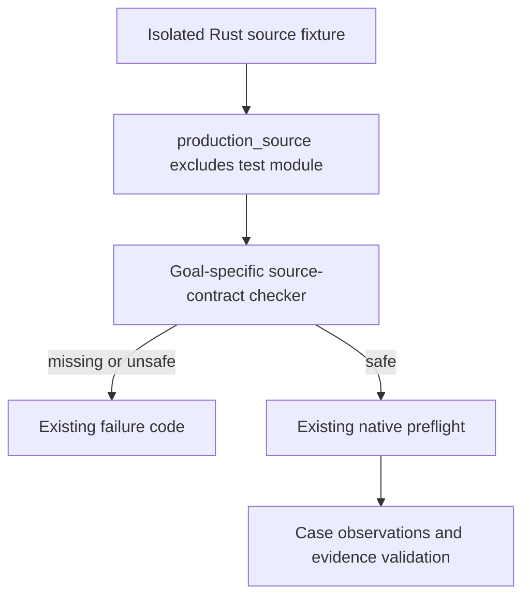

# Native Source Contract Coverage - Plan

## Goal Capsule

- **Objective:** Native acceptance must reject unsafe Review/Revision and first-use source changes instead of passing because a source scanner accepts test-only or misleading code.
- **Means:** Exercise the existing Goal 03/06/07 source-contract checkers with valid and adversarial production-like fixtures; harden an actual false-pass if the fixture demonstrates one (KTD1, KTD2).
- **Authority:** `PRODUCT.md` and the active architecture goal govern product behavior; `docs/development.md` governs verification cadence. This plan changes acceptance tooling, not product scope.
- **Stop conditions:** Do not relax historical evidence requirements, replace native UI acceptance with static checks, or claim a blocked Windows run passed.

---

## Product Contract

### Summary

The architecture refactor relocated Review controls and preview/trust code. The native Goal 03/06/07 harnesses follow those paths, but the Python tests no longer exercise their source-contract decisions with realistic fixture trees. The confirmed review finding is Goal 07's missing direct trust-order and inert-preview scanner tests; Goal 03/06 have adjacent lost direct coverage.

### Problem Frame

`valid_evidence()` seeds Goal 07's source observations as true, while its current test only checks that an already-false value is rejected. That tests evidence validation, not whether the scanner produces a truthful value. Comparable direct checks were removed for Goal 03/06 when their source paths moved. A prior review also identified that Goal 07's function-body scanner counts braces without recognizing Rust comments or strings; implementation must determine whether that creates a demonstrable false pass before changing the guard.

### Requirements

**Acceptance-guard fidelity**

- R1. Goal 07's trust-order, preview-inertness, and aggregate source checks pass on a representative safe production fixture and reject unsafe order, an active preview, or required markers confined to a Rust test module.
- R2. Goal 03's first-use/UIA/source checks and Goal 06's Review controls, shortcuts, and diagnostic accessibility checks reject missing production behavior even when decoy markers appear only in tests.
- R3. If a realistic comment/string/brace fixture makes Goal 07 falsely pass, the source scanner must reject that fixture without incorrectly rejecting the current safe production code.

**Preservation**

- R4. Historical Goal 07 v1 content-free source-observation fields stay allowed, required, and true-checked. Goal 03/06 error codes and PASS/FAIL/BLOCKED thresholds stay unchanged; no document or credential text enters evidence.

**Production-comment resilience**

- R5. Goal 03/06 source preflight must not accept removed production behavior solely because its markers remain in comments or strings.

### Scope Boundaries

- This repairs native harness check fidelity and its tests, not the Rust Review/Recovery implementation, a new GUI automation framework, or an acceptance-schema migration.
- The prior simplification observations about a four-line helper shared across goals and a few one-time source rereads are not defects; avoid adding cross-goal coupling or cache parameters merely to remove duplication.
- Full Goal 02/07 native Windows acceptance and maintainer judgment remain separate prerequisites of the active architecture goal, not outcomes this Python-only change can manufacture.

---

## Planning Contract

### Key Technical Decisions

- KTD1. **Test the checker, not the current source spelling.** Point each existing harness's `REPO` at an isolated temporary fixture tree, assert a valid baseline, then change one production rule or move its marker into `#[cfg(test)]` and assert the public failure result. Do not restore source-text snapshot tests or assert only that real checkout sources currently contain markers. Governs R1, R2.
- KTD2. **Harden only reproduced false passes.** Characterize Goal 07 brace/comment/string cases and Goal 03/06 production comment/string decoys; if one lets unsafe code pass, make the affected check fail closed at the narrowest boundary and cover the counterexample. Do not add a partial general Rust parser or new dependency without a proved need. Governs R3, R5.
- KTD3. **Keep safety checks layered.** Source-contract unit tests prove native preflight does not silently greenlight an unsafe source; existing case observations and `validate_evidence()` continue to prove their own contracts. Neither static scanner nor a mock evidence row proves GUI behavior. Governs R4.

### High-Level Technical Design

For each goal, the valid fixture is a positive control. A negative fixture differs in one protected behavior; putting the missing marker into the test module or a production comment/string must not turn a failure into success. Goal 07 also needs direct tests of its trust/preview checkers because the aggregate preflight may fail earlier for an unrelated missing fixture marker.

### Assumptions

- The user requested implementation after this plan, superseding the prior report-only review. No commit, push, PR, or product behavior change was requested.
- Fixture-only tests can run headlessly on this checkout; the current native desktop remains ineligible (`WTS_SESSION_NOT_ACTIVE`).
- Any parser hardening is conditional on a red fixture proving a false pass; merely counting braces naively is a risk to investigate, not evidence of a present runtime regression.

---

## Implementation Units

### U1. Prove Goal 07 trust and preview source contracts

- **Goal:** Close the confirmed P2 test gap and any demonstrated Goal 07 scanner false-pass.
- **Requirements:** R1, R3, R4.
- **Dependencies:** None.
- **Files:** `scripts/tests/test_native_goal07.py`; `scripts/markturbo_tools/native/goal07.py` only if a failing fixture demonstrates an actual false-pass.
- **Approach:** Use an isolated source tree containing the existing Review/workspace/document/preview boundaries. Exercise each dedicated checker and the aggregate preflight with independently varied safe and unsafe sources; leave native observation schemas untouched. If brace/comment/string placement defeats the trust check, correct its interpretation at that guard without expanding to unrelated Rust parsing.
- **Patterns to follow:** Existing `unittest` temporary-directory and `mock.patch.object(HARNESS, "REPO", ...)` conventions; the source paths and failure codes in `goal07.py`.
- **Execution note:** Start with a negative fixture that fails on the old checker before changing the scanner; preserve the valid fixture as a positive control.
- **Test scenarios:**
  - A complete safe fixture makes both direct trust/preview checks true and `source_contract_failure()` return no failure.
  - Replacing the editor source before trust revocation makes the trust checker false and returns the existing trust-source failure code; a final Restricted state alone does not rescue it.
  - Rendering Revision preview through an active WebView/HTML path makes the preview checker false and returns the existing preview-inert failure code.
  - Moving a required trust or preview marker only into a Rust test module leaves the production checker false.
  - A comment or string containing misleading braces/markers cannot make unsafe trust order pass; if the current checker does false-pass, a regression test remains with the minimal fix.
- **Verification:** The targeted Goal 07 Python tests distinguish checker output from evidence-row validation; a headless fixture smoke observes the same failure codes.

### U2. Restore Goal 03 first-use source guard fidelity

- **Goal:** Verify that first-use, welcome, Save As, and clipboard-related native preflight cannot pass from inert marker strings.
- **Requirements:** R2, R4, R5.
- **Dependencies:** None.
- **Files:** `scripts/tests/test_native_goal03.py`; `scripts/markturbo_tools/native/goal03.py` only if an exercised false-pass needs correction.
- **Approach:** Build one complete production-like welcome/workspace and document fixture under a temporary `REPO`, then remove one source contract at a time. Assert the existing failure code rather than the spelling of the current Rust implementation.
- **Test scenarios:**
  - Valid first-use/workspace and Save As fixtures produce no source-contract failure.
  - Removing a required welcome UIA control, first-use action, or document Save As event yields the corresponding existing failure code.
  - A required marker moved into `#[cfg(test)] mod tests` does not satisfy production preflight, while a `#[cfg(test)]` import before that module does not hide subsequent production code.
  - A removed first-use action with its marker left only in a production comment/string still fails preflight; fix the narrow guard if the old checker false-passes.
- **Verification:** Focused Goal 03 Python tests exercise real checker outputs; historical native evidence schema and blocker codes stay unchanged.

### U3. Restore Goal 06 Review source guard fidelity

- **Goal:** Verify relocated Review controls, shortcuts, and diagnostic accessibility remain required in production sources.
- **Requirements:** R2, R4, R5.
- **Dependencies:** None.
- **Files:** `scripts/tests/test_native_goal06.py`; `scripts/markturbo_tools/native/goal06.py` only if an exercised false-pass needs correction.
- **Approach:** Use one safe workspace-plus-review fixture, then independently remove a stable control/shortcut or diagnostic accessibility exposure and move a decoy into the Rust test module. Assert the aggregate checker and existing failure categories; keep the existing test-module extraction test only where it demonstrates the production boundary.
- **Test scenarios:**
  - Complete production fixture passes the aggregate source checker.
  - Missing Review control, keyboard shortcut, or accessible diagnostic value returns the established UIA/source-contract failure code.
  - Test-module-only controls and diagnostics do not satisfy the production checker, including when a `#[cfg(test)]` import appears before real production code.
  - A removed diagnostic accessibility exposure whose marker remains only in a production comment/string still fails preflight; fix the narrow guard if the old checker false-passes.
- **Verification:** Focused Goal 06 Python tests fail on a meaningful production guard regression while preserving native credential/confidentiality evidence rules.

---

## Verification Contract

1. Run the focused headless Python unit modules for `scripts.tests.test_native_goal03`, `scripts.tests.test_native_goal06`, and `scripts.tests.test_native_goal07`; check both safe positive fixtures and negative safety fixtures.
2. Exercise each changed `source_contract_failure()` in an isolated throwaway fixture scenario and observe its actual failure code; unit tests alone do not substitute for this smoke.
3. On the settled code, run `uv run --locked --project scripts scripts/mt.py check ci` once. Report Python/Rust pass counts and any warnings, without treating it as Windows UI acceptance.
4. If Rust or executable inputs change, rebuild the Windows release executable and rebind native evidence to its SHA-256; for Python-only test/tooling changes, keep the unchanged executable hash but do not reuse blocked evidence as PASS.
5. The existing full Goal 02/07 native suites remain pending until an active, unlocked Windows 11 x64 desktop exists; do not retry an unchanged inactive session. Maintainer interface judgment remains pending separately.

---

## Definition of Done

- U1-U3 exercise production-like valid and unsafe fixture variants and preserve the original Goal 03/06/07 failure and evidence contracts; any demonstrated false-pass is fixed at the guard, not hidden by a weaker test.
- Focused tests, direct fixture smoke, and final `check ci` pass on the final source revision. Remove throwaway fixtures and abandoned parser approaches from the repository; no unrelated Rust, dependency, or product-scope changes remain.
- Report automated implementation separately from still-pending native Windows acceptance and maintainer judgment. The original architecture goal is not complete until those external criteria are actually met.
