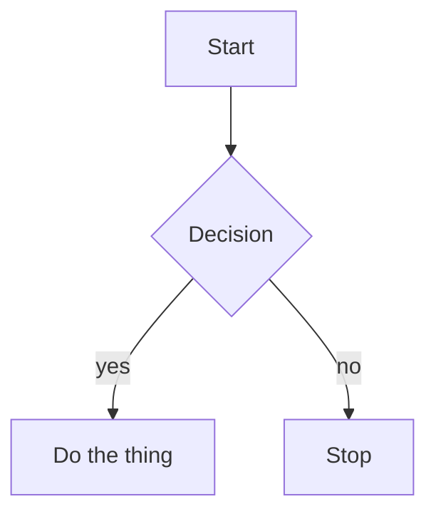
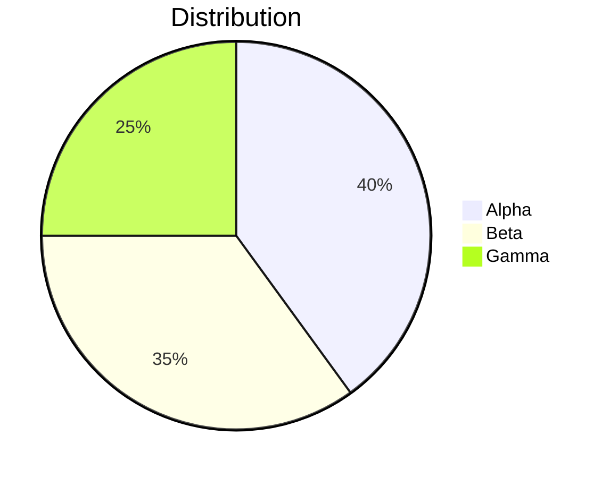
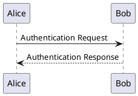
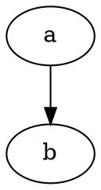

# Diagram and math fixtures

Each technology has one valid example and one invalid one. Invalid blocks must
produce an inline diagnostic with the source preserved — never a crash.

## Mermaid — valid





## Mermaid — invalid

```mermaid
!!! this is not a mermaid diagram !!!
graph --> --> -->
```

## D2 — valid

```d2
server -> database: query
database -> server: rows
server -> client: response
```

## D2 — invalid

```d2
a ->
```

## PlantUML — valid



## PlantUML — invalid

```plantuml
@startuml
this is not valid plantuml ((((
@enduml
```

## LaTeX — valid

Display math via `$$`:

$$
\frac{\partial u}{\partial t} = h^2 \left( \frac{\partial^2 u}{\partial x^2} + \frac{\partial^2 u}{\partial y^2} \right)
$$

Display math via a fence:

```math
\sum_{i=1}^{n} i = \frac{n(n+1)}{2}
```

Inline math: the value $x_i^2$ grows with $\alpha$.

## LaTeX — invalid

```math
\frac{
```

$$
\begin{unclosedenvironment}
$$

## Unregistered technology

A fence naming a diagram technology with no renderer must show its source with
an informational diagnostic, not render as an ordinary code block.


