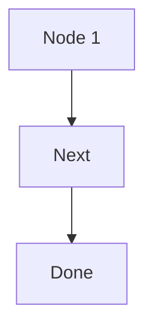
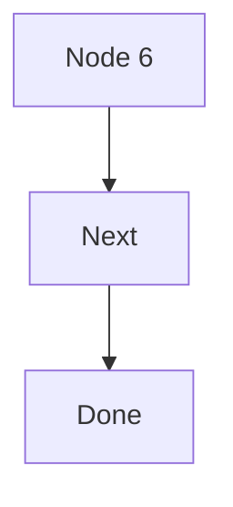
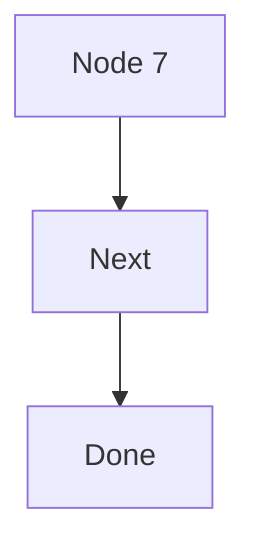
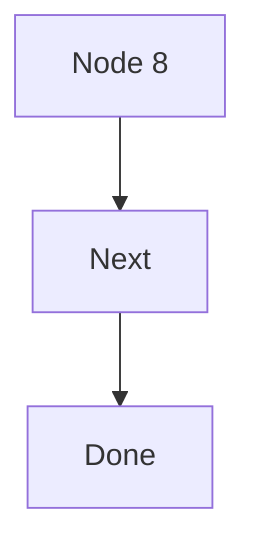
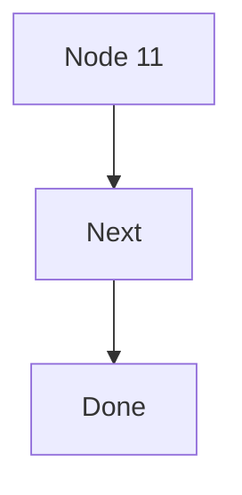
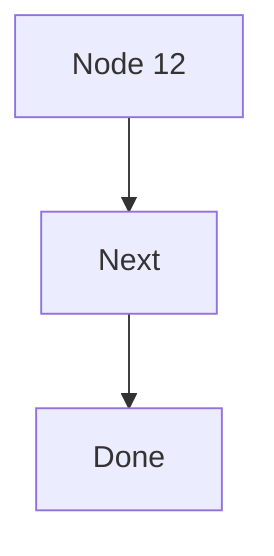
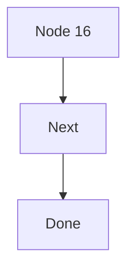
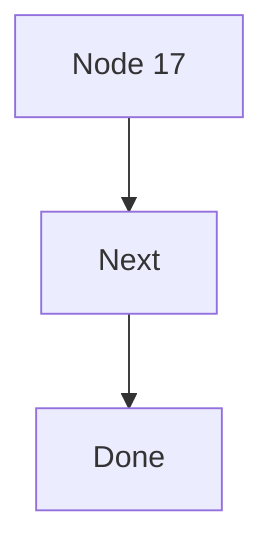

# Diagram-heavy document

## Diagram 0


```d2
a0 -> b0
```

$$
\sum_{k=1}^{1} k^2
$$

## Diagram 1



```d2
a1 -> b1
```

$$
\sum_{k=1}^{2} k^2
$$

## Diagram 2


```d2
a2 -> b2
```

$$
\sum_{k=1}^{3} k^2
$$

## Diagram 3


```d2
a3 -> b3
```

$$
\sum_{k=1}^{4} k^2
$$

## Diagram 4


```d2
a4 -> b4
```

$$
\sum_{k=1}^{5} k^2
$$

## Diagram 5


```d2
a5 -> b5
```

$$
\sum_{k=1}^{6} k^2
$$

## Diagram 6



```d2
a6 -> b6
```

$$
\sum_{k=1}^{7} k^2
$$

## Diagram 7



```d2
a7 -> b7
```

$$
\sum_{k=1}^{8} k^2
$$

## Diagram 8



```d2
a8 -> b8
```

$$
\sum_{k=1}^{9} k^2
$$

## Diagram 9


```d2
a9 -> b9
```

$$
\sum_{k=1}^{10} k^2
$$

## Diagram 10


```d2
a10 -> b10
```

$$
\sum_{k=1}^{11} k^2
$$

## Diagram 11



```d2
a11 -> b11
```

$$
\sum_{k=1}^{12} k^2
$$

## Diagram 12



```d2
a12 -> b12
```

$$
\sum_{k=1}^{13} k^2
$$

## Diagram 13


```d2
a13 -> b13
```

$$
\sum_{k=1}^{14} k^2
$$

## Diagram 14


```d2
a14 -> b14
```

$$
\sum_{k=1}^{15} k^2
$$

## Diagram 15


```d2
a15 -> b15
```

$$
\sum_{k=1}^{16} k^2
$$

## Diagram 16



```d2
a16 -> b16
```

$$
\sum_{k=1}^{17} k^2
$$

## Diagram 17



```d2
a17 -> b17
```

$$
\sum_{k=1}^{18} k^2
$$

## Diagram 18


```d2
a18 -> b18
```

$$
\sum_{k=1}^{19} k^2
$$

## Diagram 19


```d2
a19 -> b19
```

$$
\sum_{k=1}^{20} k^2
$$

## Diagram 20

```mermaid
graph TD;
  A20[Node 20] --> B20[Next];
  B20 --> C20[Done];
```

```d2
a20 -> b20
```

$$
\sum_{k=1}^{21} k^2
$$

## Diagram 21

```mermaid
graph TD;
  A21[Node 21] --> B21[Next];
  B21 --> C21[Done];
```

```d2
a21 -> b21
```

$$
\sum_{k=1}^{22} k^2
$$

## Diagram 22

```mermaid
graph TD;
  A22[Node 22] --> B22[Next];
  B22 --> C22[Done];
```

```d2
a22 -> b22
```

$$
\sum_{k=1}^{23} k^2
$$

## Diagram 23

```mermaid
graph TD;
  A23[Node 23] --> B23[Next];
  B23 --> C23[Done];
```

```d2
a23 -> b23
```

$$
\sum_{k=1}^{24} k^2
$$

## Diagram 24

```mermaid
graph TD;
  A24[Node 24] --> B24[Next];
  B24 --> C24[Done];
```

```d2
a24 -> b24
```

$$
\sum_{k=1}^{25} k^2
$$

## Diagram 25

```mermaid
graph TD;
  A25[Node 25] --> B25[Next];
  B25 --> C25[Done];
```

```d2
a25 -> b25
```

$$
\sum_{k=1}^{26} k^2
$$

## Diagram 26

```mermaid
graph TD;
  A26[Node 26] --> B26[Next];
  B26 --> C26[Done];
```

```d2
a26 -> b26
```

$$
\sum_{k=1}^{27} k^2
$$

## Diagram 27

```mermaid
graph TD;
  A27[Node 27] --> B27[Next];
  B27 --> C27[Done];
```

```d2
a27 -> b27
```

$$
\sum_{k=1}^{28} k^2
$$

## Diagram 28

```mermaid
graph TD;
  A28[Node 28] --> B28[Next];
  B28 --> C28[Done];
```

```d2
a28 -> b28
```

$$
\sum_{k=1}^{29} k^2
$$

## Diagram 29

```mermaid
graph TD;
  A29[Node 29] --> B29[Next];
  B29 --> C29[Done];
```

```d2
a29 -> b29
```

$$
\sum_{k=1}^{30} k^2
$$

## Diagram 30

```mermaid
graph TD;
  A30[Node 30] --> B30[Next];
  B30 --> C30[Done];
```

```d2
a30 -> b30
```

$$
\sum_{k=1}^{31} k^2
$$

## Diagram 31

```mermaid
graph TD;
  A31[Node 31] --> B31[Next];
  B31 --> C31[Done];
```

```d2
a31 -> b31
```

$$
\sum_{k=1}^{32} k^2
$$

## Diagram 32

```mermaid
graph TD;
  A32[Node 32] --> B32[Next];
  B32 --> C32[Done];
```

```d2
a32 -> b32
```

$$
\sum_{k=1}^{33} k^2
$$

## Diagram 33

```mermaid
graph TD;
  A33[Node 33] --> B33[Next];
  B33 --> C33[Done];
```

```d2
a33 -> b33
```

$$
\sum_{k=1}^{34} k^2
$$

## Diagram 34

```mermaid
graph TD;
  A34[Node 34] --> B34[Next];
  B34 --> C34[Done];
```

```d2
a34 -> b34
```

$$
\sum_{k=1}^{35} k^2
$$

## Diagram 35

```mermaid
graph TD;
  A35[Node 35] --> B35[Next];
  B35 --> C35[Done];
```

```d2
a35 -> b35
```

$$
\sum_{k=1}^{36} k^2
$$

## Diagram 36

```mermaid
graph TD;
  A36[Node 36] --> B36[Next];
  B36 --> C36[Done];
```

```d2
a36 -> b36
```

$$
\sum_{k=1}^{37} k^2
$$

## Diagram 37

```mermaid
graph TD;
  A37[Node 37] --> B37[Next];
  B37 --> C37[Done];
```

```d2
a37 -> b37
```

$$
\sum_{k=1}^{38} k^2
$$

## Diagram 38

```mermaid
graph TD;
  A38[Node 38] --> B38[Next];
  B38 --> C38[Done];
```

```d2
a38 -> b38
```

$$
\sum_{k=1}^{39} k^2
$$

## Diagram 39

```mermaid
graph TD;
  A39[Node 39] --> B39[Next];
  B39 --> C39[Done];
```

```d2
a39 -> b39
```

$$
\sum_{k=1}^{40} k^2
$$

## Diagram 40

```mermaid
graph TD;
  A40[Node 40] --> B40[Next];
  B40 --> C40[Done];
```

```d2
a40 -> b40
```

$$
\sum_{k=1}^{41} k^2
$$

## Diagram 41

```mermaid
graph TD;
  A41[Node 41] --> B41[Next];
  B41 --> C41[Done];
```

```d2
a41 -> b41
```

$$
\sum_{k=1}^{42} k^2
$$

## Diagram 42

```mermaid
graph TD;
  A42[Node 42] --> B42[Next];
  B42 --> C42[Done];
```

```d2
a42 -> b42
```

$$
\sum_{k=1}^{43} k^2
$$

## Diagram 43

```mermaid
graph TD;
  A43[Node 43] --> B43[Next];
  B43 --> C43[Done];
```

```d2
a43 -> b43
```

$$
\sum_{k=1}^{44} k^2
$$

## Diagram 44

```mermaid
graph TD;
  A44[Node 44] --> B44[Next];
  B44 --> C44[Done];
```

```d2
a44 -> b44
```

$$
\sum_{k=1}^{45} k^2
$$

## Diagram 45

```mermaid
graph TD;
  A45[Node 45] --> B45[Next];
  B45 --> C45[Done];
```

```d2
a45 -> b45
```

$$
\sum_{k=1}^{46} k^2
$$

## Diagram 46

```mermaid
graph TD;
  A46[Node 46] --> B46[Next];
  B46 --> C46[Done];
```

```d2
a46 -> b46
```

$$
\sum_{k=1}^{47} k^2
$$

## Diagram 47

```mermaid
graph TD;
  A47[Node 47] --> B47[Next];
  B47 --> C47[Done];
```

```d2
a47 -> b47
```

$$
\sum_{k=1}^{48} k^2
$$

## Diagram 48

```mermaid
graph TD;
  A48[Node 48] --> B48[Next];
  B48 --> C48[Done];
```

```d2
a48 -> b48
```

$$
\sum_{k=1}^{49} k^2
$$

## Diagram 49

```mermaid
graph TD;
  A49[Node 49] --> B49[Next];
  B49 --> C49[Done];
```

```d2
a49 -> b49
```

$$
\sum_{k=1}^{50} k^2
$$

## Diagram 50

```mermaid
graph TD;
  A50[Node 50] --> B50[Next];
  B50 --> C50[Done];
```

```d2
a50 -> b50
```

$$
\sum_{k=1}^{51} k^2
$$

## Diagram 51

```mermaid
graph TD;
  A51[Node 51] --> B51[Next];
  B51 --> C51[Done];
```

```d2
a51 -> b51
```

$$
\sum_{k=1}^{52} k^2
$$

## Diagram 52

```mermaid
graph TD;
  A52[Node 52] --> B52[Next];
  B52 --> C52[Done];
```

```d2
a52 -> b52
```

$$
\sum_{k=1}^{53} k^2
$$

## Diagram 53

```mermaid
graph TD;
  A53[Node 53] --> B53[Next];
  B53 --> C53[Done];
```

```d2
a53 -> b53
```

$$
\sum_{k=1}^{54} k^2
$$

## Diagram 54

```mermaid
graph TD;
  A54[Node 54] --> B54[Next];
  B54 --> C54[Done];
```

```d2
a54 -> b54
```

$$
\sum_{k=1}^{55} k^2
$$

## Diagram 55

```mermaid
graph TD;
  A55[Node 55] --> B55[Next];
  B55 --> C55[Done];
```

```d2
a55 -> b55
```

$$
\sum_{k=1}^{56} k^2
$$

## Diagram 56

```mermaid
graph TD;
  A56[Node 56] --> B56[Next];
  B56 --> C56[Done];
```

```d2
a56 -> b56
```

$$
\sum_{k=1}^{57} k^2
$$

## Diagram 57

```mermaid
graph TD;
  A57[Node 57] --> B57[Next];
  B57 --> C57[Done];
```

```d2
a57 -> b57
```

$$
\sum_{k=1}^{58} k^2
$$

## Diagram 58

```mermaid
graph TD;
  A58[Node 58] --> B58[Next];
  B58 --> C58[Done];
```

```d2
a58 -> b58
```

$$
\sum_{k=1}^{59} k^2
$$

## Diagram 59

```mermaid
graph TD;
  A59[Node 59] --> B59[Next];
  B59 --> C59[Done];
```

```d2
a59 -> b59
```

$$
\sum_{k=1}^{60} k^2
$$

