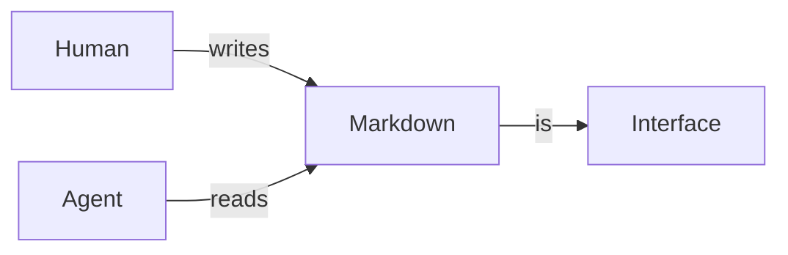

# Welcome to markturbo

This folder is a **sample workspace**. Everything here is an ordinary file —
open it in your editor, commit it to git, or hand it to an agent. Nothing was
converted on the way in and nothing will be on the way out.

## Try this first

1. **Switch layouts.** The **View** dropdown in the bar offers five, and only
   the ones a document can actually use:
   - `Native` is the fast path — GPUI rendering, no browser. The default for
     Markdown.
   - `Web` is the compatibility path, through an embedded browser.
   - `Split · Native` and `Split · Web` put the editor beside a preview; which
     renderer fills it is part of the choice, not a second control.
   - `Source` is the editor alone — and the only option for a file with no
     rendered form, like a `.rs`.
2. **Edit something.** Type in `Source` or either `Split`. The preview follows
   as you type. To make it follow your *scrolling* too, turn on Sync scrolling
   in Settings (`Ctrl/Cmd+,`) — it is off by default because the mapping is
   proportional, so one tall diagram moves the preview further than the eye
   expects.
3. **Open the Harness tab** in the left sidebar. There is one skill in
   `.claude/skills/`, and one deliberately broken one to show validation.
4. **Open `docs/diagrams.md`** for live Mermaid, D2, and math.
5. **Press `Ctrl+S`.** The file is written back as plain Markdown, preserving
   its original line endings, byte-order mark, and character encoding — a GBK or
   Shift-JIS document opened and saved untouched is byte-identical.

## Diagrams and math render from source



Math renders natively too — no browser needed:

$$
\sum_{i=1}^{n} i = \frac{n(n+1)}{2}
$$

## Agent artifacts are first-class

markturbo recognizes these by name, not just by extension, and labels them in
the toolbar:

| File | Recognized as |
|---|---|
| `AGENTS.md` | Agent Instructions |
| `CLAUDE.md` | Claude Instructions |
| `SKILL.md` | Agent Skill |
| `.cursor/rules/*` | Cursor Rule |
| `*.instructions.md` | Scoped Instructions |

See `AGENTS.md` next to this file — open it and check the label in the toolbar.

## Unicode works properly

中文段落，包含 `代码`、**粗体**、以及[链接](https://example.com)。

日本語も問題ありません。Emoji: 🎉 👩‍💻

## Try translation

Select a paragraph and press `Ctrl+Shift+L`, or press `Ctrl+Shift+T` for the
whole document.

This needs an API key. Set one in Settings (`Ctrl/Cmd+,`), or export
`ANTHROPIC_API_KEY` or `OPENAI_API_KEY` before launching; a key in Settings
wins. Without one, markturbo says translation is unconfigured rather than
pretending — there is no offline stand-in that could stand in for a translation
without lying about it.

What it will *not* touch is the interesting part:

```rust
let value = String::new();   // code is never translated
```

Inline `code`, the URL in [this link](https://example.com/unchanged), the math
above, the diagram source, and the `#` heading markers all stay untouched. The
document engine splits the text into translatable and verbatim segments that
tile the range exactly, so the provider only ever sees prose — reassembly cannot
damage structure it never received.

> Undo with `Ctrl+Z` if you don't want to keep it.
