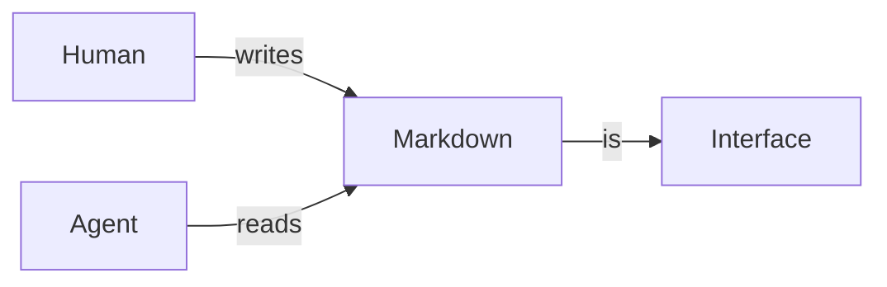

# Welcome to markturbo

This folder is a **sample workspace**. Everything here is an ordinary file —
open it in your editor, commit it to git, or hand it to an agent. Nothing was
converted on the way in and nothing will be on the way out.

## Try this first

1. **Switch views.** The toolbar has `Source`, `Native`, `Web`, `Split`.
   - `Native` is the fast path — GPUI rendering, no browser.
   - `Web` is the compatibility path.
   - `Split` shows source and preview together, with a button to pick which
     renderer fills the preview pane.
2. **Edit something.** Type in `Source` or `Split`. The preview follows.
3. **Open the Skills tab** in the left sidebar. There is one skill in
   `.claude/skills/`, and one deliberately broken one to show validation.
4. **Open `docs/diagrams.md`** for live Mermaid, D2, and math.
5. **Press `Ctrl+S`.** The file is written back as plain Markdown, preserving
   its original line endings.

## Diagrams and math render from source



Math renders natively too — no browser needed:

$$
\sum_{i=1}^{n} i = \frac{n(n+1)}{2}
$$

## Agent artifacts are first-class

markturbo recognizes these by name, not just by extension, and labels them in
the toolbar:

| File | Recognized as |
|---|---|
| `AGENTS.md` | Agent Instructions |
| `CLAUDE.md` | Claude Instructions |
| `SKILL.md` | Agent Skill |
| `.cursor/rules/*` | Cursor Rule |
| `*.instructions.md` | Scoped Instructions |

See `AGENTS.md` next to this file — open it and check the label in the toolbar.

## Unicode works properly

中文段落，包含 `代码`、**粗体**、以及[链接](https://example.com)。

日本語も問題ありません。Emoji: 🎉 👩‍💻

## Try translation

Select a paragraph and press `Ctrl+Shift+L`, or press `Ctrl+Shift+T` for the
whole document.

Without an API key this uses the offline **Echo** provider, which prefixes each
translatable fragment with `[zh]`. That is not a real translation — it is a way
to *see* exactly what would be sent. Notice what it does **not** touch:

```rust
let value = String::new();   // code is never translated
```

Inline `code`, the URL in [this link](https://example.com/unchanged), the math
above, the diagram source, and the `#` heading markers all stay untouched.

For real translation, set `ANTHROPIC_API_KEY` before launching.

> Undo with `Ctrl+Z` if you don't want to keep it.
