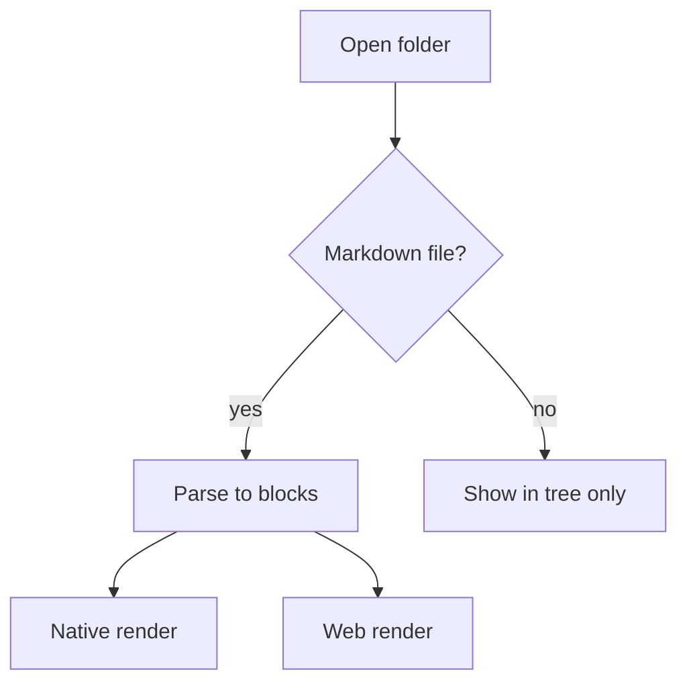
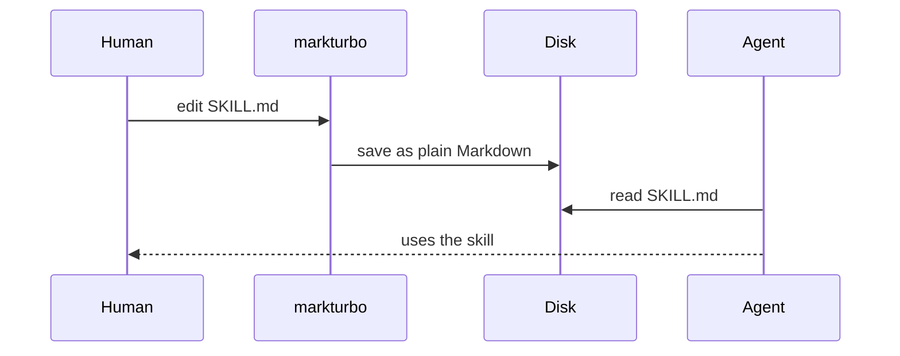
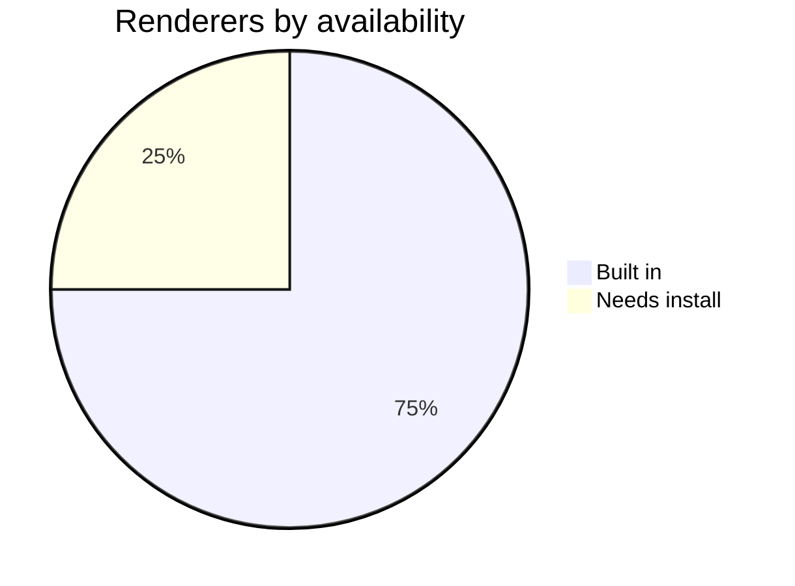
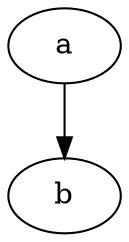

# Diagrams and math

Every diagram below is rendered **from the source in this file**. Edit one in
`Split` view and watch it update.

Three of the four renderers are compiled in and always work. PlantUML needs a
local install; if you don't have it, its blocks show an install hint instead of
failing — which is the point.

## Mermaid



Sequence diagrams work too:



And pie charts:



## D2

```d2
human -> markdown: writes
agent -> markdown: reads
markdown -> markturbo: opened by
markturbo -> markdown: saves unchanged
```

## Math

Inline math sits in a sentence: the complexity is $O(n \log n)$ for the sort.

Display math gets its own block:

$$
\frac{\partial u}{\partial t} = h^2 \left(
  \frac{\partial^2 u}{\partial x^2} + \frac{\partial^2 u}{\partial y^2}
\right)
$$

A fenced `math` block works the same way:

```math
e^{i\pi} + 1 = 0
```

## PlantUML

```plantuml
Alice -> Bob: Authentication Request
Bob --> Alice: Authentication Response
```

If PlantUML is not installed, the block above shows an install hint. Everything
else on this page still renders.

## Failures are diagnostics, not crashes

The block below is deliberately invalid. It shows an inline error **with the
original source preserved** — the app does not crash, and you do not lose text.

```mermaid
!!! this is not a valid mermaid diagram !!!
```

Same for math:

```math
\frac{
```

## An unregistered technology

markturbo knows `graphviz` names a diagram, but ships no renderer for it. Rather
than silently showing it as a code block, it reports that no renderer is
registered — so you can tell "not supported" from "rendered as text".



Adding a renderer is a registration, not a rewrite: implement `BlockRenderer`,
register it, and add the fence language. Nothing in the parser or the views
changes.
